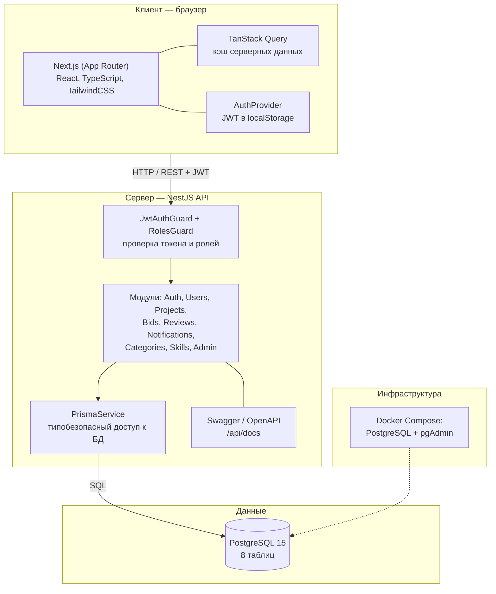

# Архитектура приложения

Платформа построена как монорепозиторий из двух приложений: клиентского
(Next.js) и серверного (NestJS), которые работают с общей базой PostgreSQL.

## Схема взаимодействия

## Слои

**Клиент (`apps/web`)**
- App Router Next.js: публичные страницы (`/`, `/login`, `/register`) и
  защищённая группа `(protected)`.
- `AuthProvider` хранит состояние авторизации, токен — в `localStorage`.
- TanStack Query кэширует серверные данные, делает инвалидацию после мутаций.
- `apiClient` (axios) добавляет `Authorization: Bearer` и перехватывает `401`.

**Сервер (`apps/api`)**
- Модульная структура NestJS: каждый домен — отдельный модуль
  (контроллер + сервис + DTO + entity для Swagger).
- Аутентификация — JWT-стратегия Passport; авторизация по ролям —
  декоратор `@Roles()` + `RolesGuard`.
- `PrismaService` инкапсулирует доступ к БД; глобальный фильтр исключений
  приводит ошибки к единому формату.
- Документация API генерируется через Swagger.

**База данных**
- PostgreSQL 15, схема и миграции управляются Prisma.
- 8 таблиц (см. [ER-диаграмму](./er-diagram.md)).

**Инфраструктура**
- Docker Compose поднимает PostgreSQL и pgAdmin.
