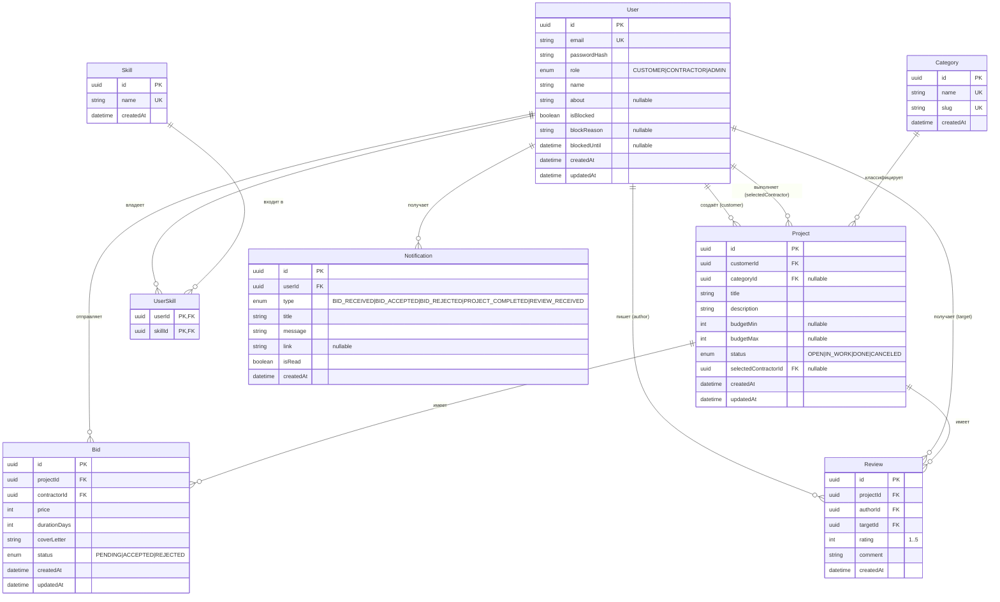

# ER-диаграмма базы данных

Платформа взаимодействия заказчиков и исполнителей IT-проектов.
СУБД: PostgreSQL. ORM: Prisma.

## Описание связей

| Связь | Тип | Описание |
|-------|-----|----------|
| User → Project (customer) | 1:N | Заказчик создаёт проекты |
| User → Project (selectedContractor) | 1:N | Исполнитель назначается на проект |
| User → Bid | 1:N | Исполнитель отправляет отклики |
| Category → Project | 1:N | Категория классифицирует проекты |
| Project → Bid | 1:N | На проект приходят отклики |
| User ↔ Skill (через UserSkill) | M:N | Навыки пользователя |
| Project → Review | 1:N | Отзывы по проекту |
| User → Review (author/target) | 1:N | Автор и получатель отзыва |
| User → Notification | 1:N | Уведомления пользователя |
